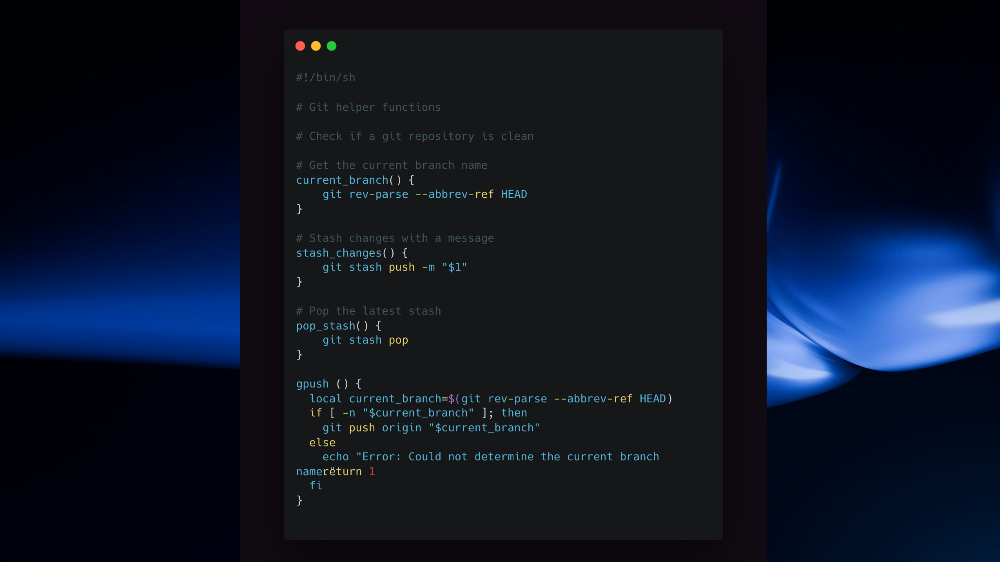

# shellfu



## How to use it?

- Clone the repo:

```bash
git clone https://github.com/deependujha/shellfu.git ~/.shellfu
```

- Add the following line to your `~/.bashrc` or `~/.zshrc` file:

```bash
# Load custom shell scripts from ~/.shellfu/scripts directory
SCRIPT_DIR="$HOME/.shellfu/scripts"

if [ -d "$SCRIPT_DIR" ]; then
  for script in "$SCRIPT_DIR"/*.sh; do
    if [ -f "$script" ]; then
      source "$script"
    fi
  done
  unset script # Clean up the variable
else
  echo "Warning: Custom shell script directory '$SCRIPT_DIR' not found."
fi
```
